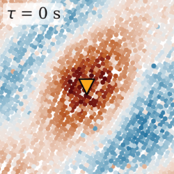

# Source effects in higher-order ambient seismic field correlations

This repository contains all data products, metadata, and codes necessary to reproduce all figures of the manuscript "Source effects in higher-order ambient seismic field correlations" by Schippkus et al. (2025).

## Abstract

 
Seismic interferometry of the ambient seismic field is widely used for surface wave imaging. It typically requires synchronous station recordings and assumes uniform noise source distributions. Higher-order correlations, such as the re-correlation of direct waves ($`C_2`$), have been suggested to facilitate imaging with asynchronous data and to improve an incomplete source distribution. Using field data and simulations, we show that $`C_2`$ surface wavefields are instead highly sensitive to the original source distribution and even amplify the effects associated with the directional incidence. This can lead to systematic errors in the obtained velocity estimates and the downstream subsurface images. Strategies for selecting auxiliary stations in the re-correlation process do not mitigate this bias but can introduce additional wavefield distortions. Local and far-field imaging approaches using higher-order $`C_2`$ correlation wavefields are affected by significant and systematic velocity estimation errors. Our results show that the re-correlation of direct waves is not an all-purpose correlation wavefield enhancement technique, and highlight the need for a careful consideration of source effects for improved imaging.

## Repository structure

- `data/`: Folder to hold data and simulations. For instructions to download and generate the data, see below.
- `figures/`: All manuscript figures, generated by the Jupyter notebooks in `notebooks/`.
- `meta/`: Station metadata and matplotlib style file.
- `notebooks/`: Jupyter notebooks that implement all processing and generate the manuscript figures.

## Data

The folder `data/` is empty at the start. All correlation functions have to be downloaded and/or generated. We do not provide raw field data, but only the correlation functions necessary for reproduction of our results.

### $C_1$ correlation functions 

#### Field data

Field data $C_1$ correlations are hosted at University of Hamburg research data repository.

**DOWNLOAD HERE**: [...](#)

Extract `correlations.zip` in `data/` directory.

The extracted files are 

- `correlations_for_c1_data.pt`: $C_1$ cross-correlations of all 1990 receiver stations with the master station in the center. Saved as a `torch.tensor` with shape `[1990, 1201]`. First dimension (the receiver stations) is sorted alphabetically. Required for comparison of $C_1$ and $C_2$ wavefields.
- `correlations_for_c2_data.pt`: $C_1$ cross-correlations of all 1990 receiver stations, including the master station, with the 304 auxiliary stations surrounding them. Saved as a `torch.tensor` with shape `[1990, 305, 1201]`. First dimension (the receiver stations) and second dimension (the auxiliary stations) are sorted alphabetically. The basis for computing $C_2$ correlations.

These correlations are computed as described in the manuscript: ~4 weeks of continuous recordings are cut into 1-hr windows and spectrally whitened. All windows are cross-correlated and linearly stacked. No additional processing.

#### Simulations

Run the notebook `compute_correlations.ipynb` in `notebooks/` with the parameter `synthetic = True` in the second cell to generate both the simulated $C_1$ and $C_2$ correlation functions. 

Run it three times for the different `source_mode` settings (`source_mode="both"`, `source_mode="boundary"`, `source_mode="isolated"`) to produce all sets of correlation functions used in the manuscript.

### $C_2$ correlation functions

#### Field data

After downloading the data, run the notebook `compute_correlations.ipynb` in `notebooks/` with the parameter `synthetic = False` to compute the $C_2$ correlation functions from the field data $C_1$ correlations.

#### Simulations

See $C_1$ simulation instructions above.

## Requirements

The `pyproject.toml` file lists all packages required to run all notebooks. Follow your favourite installation procedure via `uv`, `pip`, or `conda`.